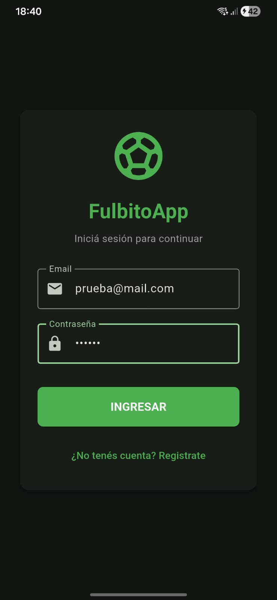
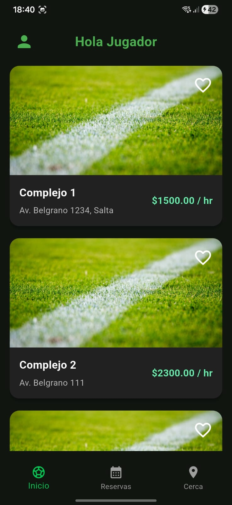
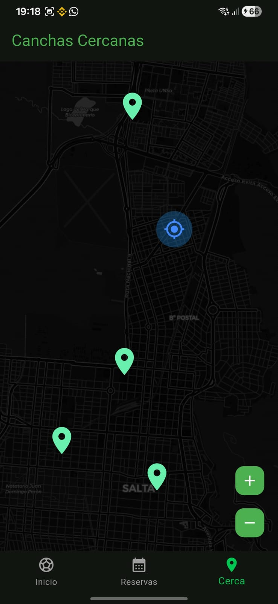
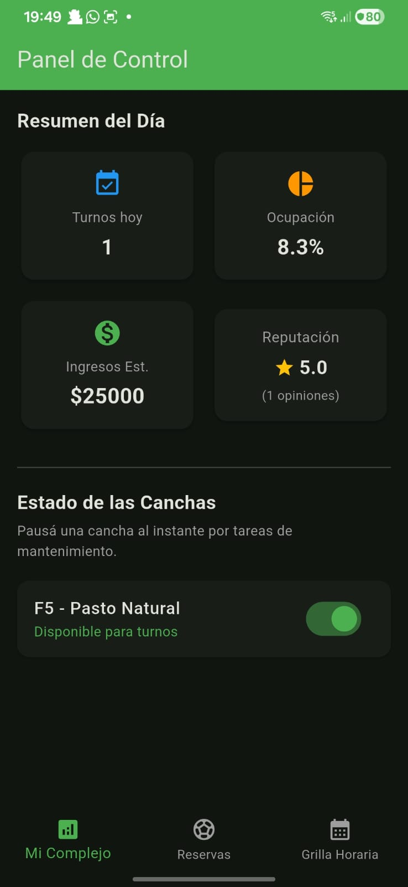
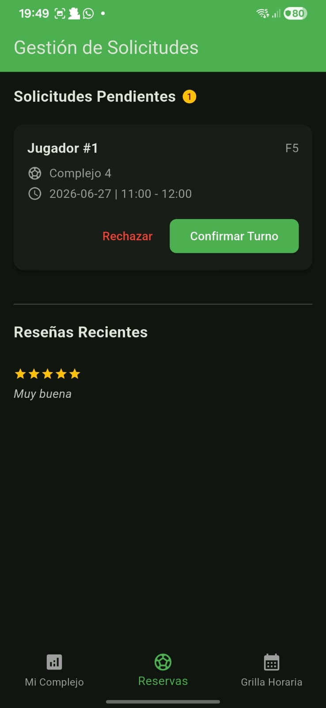

# ⚽ Fulbito App

[](https://flutter.dev)
[](https://www.django-rest-framework.org)
[](https://opensource.org/licenses/MIT)

### Gestión y Reserva de Canchas de Fútbol — Salta Capital

Proyecto desarrollado en el marco de la asignatura **Optativa II: Introducción al Desarrollo de Software Libre (2026)** de la **Tecnicatura Universitaria en Programación (UNSa)**. 

Aplicación multiplataforma orientada a centralizar la búsqueda, localización geográfica y reserva automatizada de canchas de fútbol amateur en Salta Capital, optimizando la comunicación interactiva entre deportistas y administradores de complejos.

---

## 👥 Equipo

| Integrante | Rol Primario | Foco de Desarrollo |
|---|---|---|
| **Luciano Burgos** | Arquitecto Backend | Django REST Framework, Autenticación y Postgres |
| **Walter Flores** | Desarrollador Frontend | Flutter — Módulo Usuario Jugador (Mapas y Reservas) |
| **Enzo Alfaro** | Desarrollador Frontend | Flutter — Módulo Dueño de Complejo (Dashboard y Grillas) |

---

## 📁 Estructura del Repositorio

```text
fulbito-app/
├── backend/              # Servidor y API en Django (Python)
│   ├── config/           # Configuración general del proyecto (settings, urls)
│   ├── users/            # Capa de usuarios y asignación de roles nativos
│   ├── authentication/   # Gestión de sesiones mediante tokens de acceso
│   ├── complejos/        # Entidades del dominio: canchas, turnos, reservas y reseñas
│   ├── manage.py
│   └── requirements.txt  # Dependencias del servidor (Django, psycopg2 para Postgres)
│
└── mobile_app/           # Aplicación Multiplataforma en Flutter (Dart)
    ├── lib/
    │   ├── core/
    │   │   ├── constants/# Paletas de colores, roles y enrutamiento estático
    │   │   └── services/ # ApiClient — Cliente HTTP unificado hacia el backend
    │   ├── features/
    │   │   ├── auth/     # Vistas de acceso distribuidas por rol
    │   │   ├── jugador/  # Pantallas del flujo de clientes (Canchas, Reservas, Mapas)
    │   │   └── owner/    # Pantallas del flujo de administración (Dashboard, Turnos, Grilla Global)
    │   └── main.dart
    └── pubspec.yaml      # Dependencias del cliente (Flutter SDK, lints)
```
---

🚀 Cómo levantar el proyecto de forma local
Requisitos previos
Python 3.10 o superior

Flutter SDK (Canal estable instalado)

Git para el control de versiones

### 1 — Backend Django

```
# Entrar a la carpeta del backend
cd backend

# Crear y activar el entorno virtual
python -m venv venv

# Windows
venv\Scripts\activate.bat

# macOS / Linux
source venv/bin/activate

# Instalar dependencias
pip install -r requirements.txt

# Crear las tablas en la base de datos
python manage.py migrate

# Levantar el servidor
python manage.py runserver
```

El servidor queda corriendo en `http://127.0.0.1:8000`.

### 2 — App Flutter

```
# Entrar a la carpeta del frontend
cd mobile_app

# Instalar dependencias de Dart
flutter pub get

# Correr en Chrome
flutter run -d chrome

# Correr en emulador Android
flutter run -d android

## Arquitectura

La app sigue el patrón **Feature-First** con separación en capas:

```
Screen  →  Provider  →  Service  →  ApiClient  →  Django REST API
```
- **Screen:** solo renderiza la UI
- **Provider:** maneja el estado
- **Service:** lógica de negocio, llama a la API
- **ApiClient:** único punto de contacto con el backend Django

---

## Roles de usuario

| Rol | Descripción |
|---|---|
| Jugador | Busca complejos, hace reservas, deja reseñas |
| Dueño de Complejo | Gestiona sus canchas, confirma reservas |
| Super Admin | Modera la plataforma desde el panel Django |

---

## Estado del proyecto

- [x] Estructura base del proyecto
- [x] Configuración de Django + Django REST Framework
- [ ] Modelos y migraciones (users, complejos, reservas, reseñas)
- [ ] Endpoints de autenticación (registro, login, token)
- [ ] Flujo jugador en Flutter
- [ ] Flujo dueño en Flutter
- [ ] Integración Flutter ↔ Django

---
```
## 📸 Capturas de Pantalla

### 🔑 Acceso y Módulo del Jugador
Sección orientada al usuario final, permitiendo el ingreso seguro, la exploración de complejos deportivos mediante geolocalización en Salta Capital y el listado de canchas disponibles.

| Pantalla de Login | Lista de Canchas Disponibles | Mapa de Canchas Cercanas |
|:---:|:---:|:---:|
|  |  |  |

---

### 🏢 Módulo de Administración (Dueño de Complejo)
Panel de control centralizado para el administrador del club. Permite monitorear el resumen financiero diario, tasas de ocupación horaria y pausar canchas de forma instantánea por tareas de mantenimiento.

| Panel de Control (Dashboard) |
|:---:|
|  |   |

```
```
📜 Licencia del Proyecto
Este proyecto se distribuye de manera abierta bajo los términos y condiciones de la Licencia MIT.

Cualquier usuario o estudiante tiene permitido de forma libre la copia, modificación, distribución y comercialización comercial del software, con la única condición obligatoria de incluir la atribución del derecho de autor original citando a los integrantes del equipo. Consulta el archivo LICENSE para más detalles.
